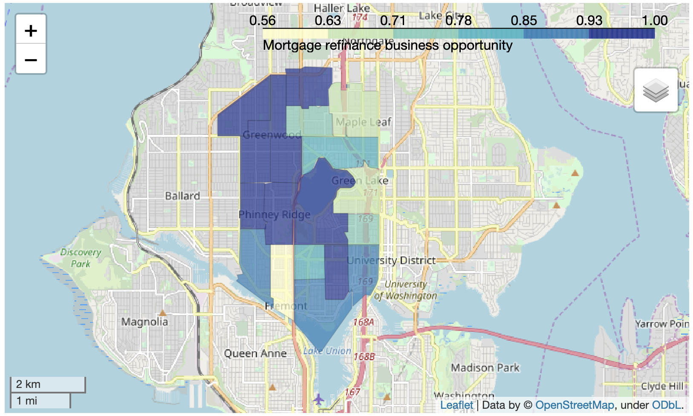

## intelliRefinder
Predicting optimal locations for mortgage refinance business opportunities using\
machine learning algorithm on US OpenStreetMap(OSM) data.\
\
Example: zip code 98103 related area, King County, WA

## Problem
According to Zillow Research, mortgage market is about $33.3 trillion dollars in 2018. Each year, the loan origination is the primary revenue generator for the mortgage lenders. Today, non-bank (small, regional) mortgage lenders account for more than 60% of all mortgage originations. The majority of them are small and local players that have to consistently optimize their marketing strategies given limited financial and technological resources to keep themselves competitive.\
\
The mortgage refinance is another healthy business, besides the home purchase loan, to maintain cash flow for those small and local mortgage lenders. So, identifying the mortgage refinance opportunities would be their priority and the correct business opportunity identification would be critical for their success.

## Data
* 2008-2017 mortgage transaction data, available via Home Mortgage Disclosure Act;
* Demographic data from 10-year Census American Community Survey data;
* King County, WA selected for the demo project.

## Tools and Techs
* Python
  * Scikit-Learn
  * GeoPandas
  * Streamlit
* GIS
* Logistic Regression
* Feature Engineering
* SQL
* AWS EC2, S3

## Actionable Insight
The trained logistic model classified mortgage refinance opportunities in King County, WA and was then used to create an interactive maps to help mortgage lenders to actively identify potential mortgage refinance business in the area of interest and to decide how optimize their resource allocations for marketing. Please visit [intelliRefinder](http://bit.ly/IntelliRefinderDemo) to explore the mortgage refinance opportunities of King County, WA.

Important features for classifying the mortgage refinance opportunity:
* Loan status
* Marriage status
* Loaner purchaser
* Income
* Minor (age<18) population
* Work travel time

### Contact
meng.chen03(at)gmail.com
